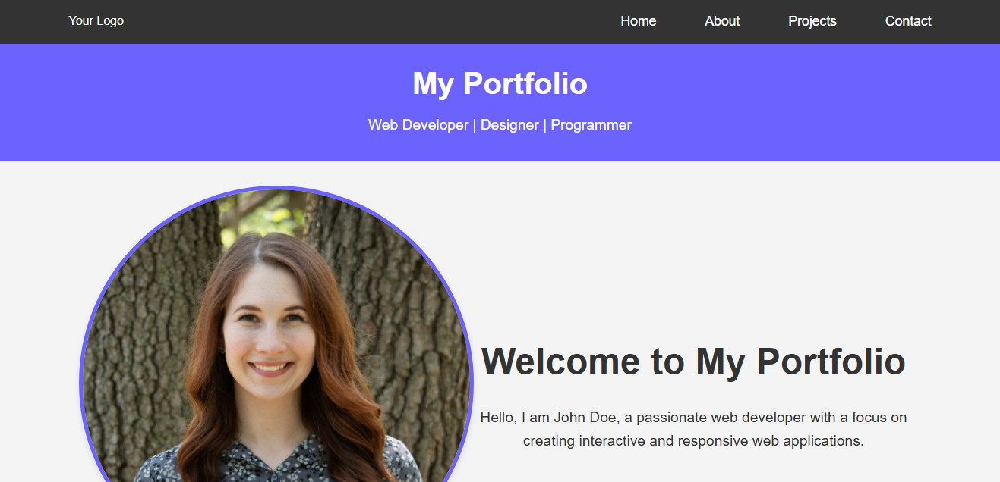

# React + Vite Project



This template provides a minimal setup to get React working in Vite with HMR (Hot Module Replacement) and some ESLint rules. Vite ensures fast and efficient development experience, while React allows for building dynamic user interfaces.

Watch the app in action:
https://667d5ad5556142c8dd69a7eb--imranportfolioreactjs.netlify.app/

## Table of Contents

- [Features](#features)
- [Getting Started](#getting-started)
  - [Prerequisites](#prerequisites)
  - [Installation](#installation)
- [Usage](#usage)
- [Available Scripts](#available-scripts)
- [Project Structure](#project-structure)
- [Contributing](#contributing)
- [License](#license)

## Features

- ⚡️ **Fast Development**: Vite's Hot Module Replacement (HMR) ensures rapid development.
- 🔍 **Linting**: ESLint is integrated for code quality and consistency.
- 📦 **Minimal Setup**: Provides a minimal yet powerful setup to get started with React and Vite.

## Getting Started

### Prerequisites

Ensure you have the following installed:

- Node.js (>=14.18.0)
- npm (>=6.14.0) or yarn (>=1.22.0)

### Installation

1. Clone the repository:

   ```sh
   git clone https://github.com/Imran751/react-vite-project.git
   cd react-vite-project
   ```

2. Install the dependencies:

   ```sh
   npm install
   # or
   yarn install
   ```

## Usage

Start the development server:

```sh
npm run dev
# or
yarn dev
```

Open your browser and navigate to `http://localhost:3000`. You should see your React app running!


## Available Scripts

In the project directory, you can run:

### `npm run dev` / `yarn dev`

Runs the app in the development mode. Open `http://localhost:3000` to view it in your browser.

### `npm run build` / `yarn build`

Builds the app for production to the `dist` folder. It correctly bundles React in production mode and optimizes the build for the best performance.

### `npm run serve` / `yarn serve`

Serves the production build locally. Useful for testing the production build before deployment.

### `npm run lint` / `yarn lint`

Runs ESLint to check for linting errors.

## Project Structure

```
├── public
│   └── index.html
├── src
│   ├── assets
│   │   └── images
│   ├── components
│   │   └── About.jsx
│   │   └── Contact.jsx
│   │   └── Footer.jsx
│   │   └── Header.jsx
│   │   └── Home.jsx
│   │   └── Navbar.jsx
│   │   └── Projects.jsx
│   ├── App.jsx
│   ├── main.jsx
│   └── styles
│       └── main.css
├── .eslintrc.js
├── .gitignore
├── package.json
├── README.md
├── vite.config.js
└── yarn.lock
```

## Contributing

Contributions are what make the open-source community such an amazing place to learn, inspire, and create. Any contributions you make are **greatly appreciated**.

1. Fork the Project
2. Create your Feature Branch (`git checkout -b feature/AmazingFeature`)
3. Commit your Changes (`git commit -m 'Add some AmazingFeature'`)
4. Push to the Branch (`git push origin feature/AmazingFeature`)
5. Open a Pull Request

## License

Distributed under the MIT License. See `LICENSE` for more information.

---

Feel free to customize this README template according to your project's specific needs and add any additional sections or information that might be useful for your users.
